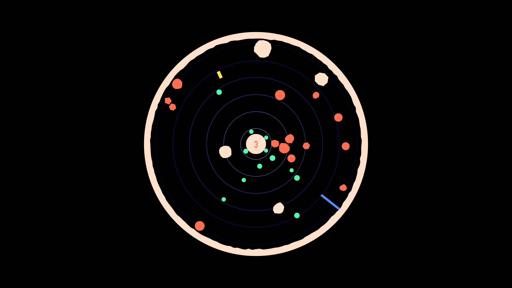

# vetovoima

## _vetovoima_ is an arcade game where you control the gravity!

The world is a hollow circle with a star in the center.
You're a **Yellow Block** and your goal is to get to the **Tall Blue Block** before the time runs out. You have to make your way through shifting debris.
You can **move forward**, **slow down** and **control the intensity and direction of gravity**.
The levels are randomly generated and the challenge is to survive the chaos that ensues from changes to gravity.
There's an increasing amount of debris flying around and less time to make it to the goal as you progress through the levels.

### Controls

➡️ **Right arrow**: move forward

⬅️ **Left arrow**: slow down

↕️ **Up/Down arrow**: control the gravity

## Technical info

vetovoima is built with Rust, using the [Bevy game engine](https://bevyengine.org).
The visuals are rendered using [bevy_prototype_lyon](https://crates.io/crates/bevy_prototype_lyon) and the gravity/physics simulation is powered by [bevy_rapier2d](https://crates.io/crates/bevy_rapier2d).

## How to build and run the game

You can run the game like any common Rust project with **cargo**

`cargo run`

To create an optimized version, use

`cargo build --release`

You'll find the executable under `./target/release/`.
You need to symlink or copy the `assets` folder to the same directory where the release build is executed from.
